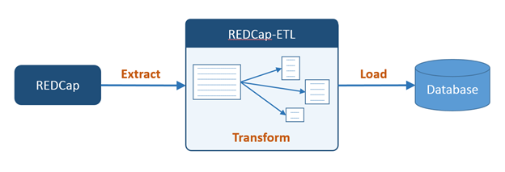

REDCap-ETL
================================================

REDCap-ETL (REDCap Extract, Transform, Load) is an application that can extract data from
[REDCap](https://www.project-redcap.org/), transform the extracted data, and load the
transformed data into a database.

REDCap-ETL runs as a stand alone application outside of REDCap, and can require a fair amount
of effort to set up.
However, a REDCap external module for REDCap-ETL is now available that can be set up and run
within REDCap. The setup effort for the external module is generally substantially less than
for the REDCap-ETL application.

The REDCap-ETL external module in the official external module
repository ([REDCap Repo](https://redcap.vanderbilt.edu/consortium/modules/index.php)),
and you should be able to find and install it from within REDCap.

Even though the REDCap-ETL external module can be substantially easier to set up and use,
there are still cases where you might want to use the REDCap-ETL application:

* It's not possible or practical to get the REDCap-ETL external module installed on your system
* You want to reduce the load on your REDCap server as much as possible
* You want to use the CSV or SQLite database types (these are currently only supported in
    the REDCap-ETL application)

###Documentation:

* [Installation Guide](docs/InstallationGuide.md)
* [Configuration Guide](docs/ConfigurationGuide.md)
    * [Transformation Rules Guide](docs/TransformationRulesGuide.md)
* [Developer Guide](docs/DeveloperGuide.md)
    * [Software Architecture](docs/SoftwareArchitecture.md)

