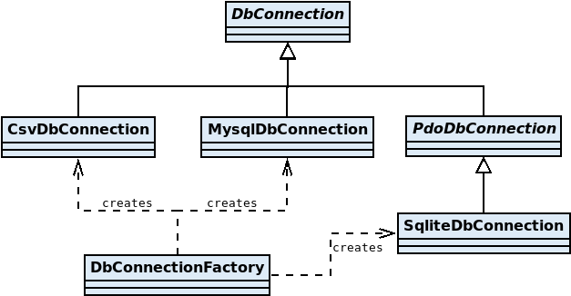

<!-- =================================================
Copyright (C) 2019 The Trustees of Indiana University
SPDX-License-Identifier: BSD-3-Clause
================================================== -->

REDCap-ETL Developer Guide
======================================

This guide is intended for people who want to modify or extend the REDCap-ETL software.
If you just want to use the REDCap-ETL software, please see the installation and configuration guides.

Development Environment Setup
-------------------------------------

This is a list of the steps for setting up a REDCap-ETL development environment. Example commands are shown for Ubuntu 16.

1. **Install PHP**

        sudo apt install php php-curl php-mbstring php-mysql php-xml
        sudo phpenmod mysqli   # enable mysqli extension
        sudo phpenmod pdo_mysql # enable PDO extension for PHP
        sudo apt install php-sqlite3  # add PHP support for SQLite
        sudo apt install php-xdebug  # Install XDebug to be able to see phpunit test code coverage

2. **Install Composer** (needed to get PHPCap and development dependencies)

        sudo apt install composer

3. **Install sendmail** (needed for logging to e-mail)

        sudo apt install sendmail
        
    Note: after REDCap-ETL has been installed, its **bin/email_test.php** script can be used to test if e-mail logging
works.

4. **Install MySQL**

        sudo apt install mysql-server
        sudo mysql_secure_installation
        systemctl status mysql.service   # check status
        
        # Set up SSL
        sudo mysql_ssl_rsa_setup --uid=mysql
        sudo systemctl restart mysql


5. **Create MySQL Database and User**

    Create a database and database user that will be used as the place to store the REDCap data,
    for example, in MySQL use:

        CREATE DATABASE `etl_test`;
        CREATE USER 'etl_user'@'localhost' IDENTIFIED BY 'etlPassword';
        GRANT ALL ON `etl_test`.* TO 'etl_user'@'localhost';

6. **Install SQLite**

        sudo apt install sqlite3
        sudo apt install sqlitebrowser  # optional

7. **Install PostgreSQL**

    To run the PostgreSQL system tests (discussed below), you will need to install        
    PostgreSQL. If PostgreSQL is not installed, these tests should be automatically skipped.

        sudo apt install postgresql postgresql-contrib
        sudo apt install php-pgsql

    You can use the following command to test your PostgreSQL installation:

        sudo -u postgres psql -c "SELECT version();"

    To log in as the root user use:

        sudo -u postgres psql

    To create the a database, schema and user that match the values in the test configuration file, use:

        create database etl_test;
        \connection etl_test
        create schema etl_test;

        create user etl_user with password 'etlPassword';
        grant all privileges on database etl_test to etl_user;
        grant usage on schema etl_test to etl_user;
        grant create on schema etl_test to etl_user;

    To test the account created:

        psql -U etl_user -h localhost -d etl_test -W


8. **Install SQL Server**

    To run the SQL Server system tests (discussed below), you will need to install SQL Server.
    If SQL Server is not installed, these tests should be automatically skipped.

    For details see [SQL Server](SqlServer.md).

9. **Install Git**

        sudo apt install git
        # Add e-mail and name information, for example:
        git config --global user.email "jsmith@someuniversity.edu"
        git config --global user.name "J Smith"

10. **Get REDCap-ETL Code**

    Execute the following command in the directory where
    you want to put REDCap-ETL:

        git clone https://github.com/IUREDCap/redcap-etl

11. **Install Composer Dependencies**

    In the top-level directory where the code was downloaded, run:

        composer install

### REDCap-ETL Directory Structure

After the steps above have been successfully completed,
the REDCap-ETL software directory should have a structure similar to
what is listed below. The main directories and files are as follows:

* __bin/__ - directory containing scripts
* __config/__ - default configuration directory for REDCap-ETL
* __dependencies/__ - static dependencies used for production installation
* __docs/__ - documentation
* __projects/__ - REDCap-ETL project templates for configuration and logging
* __src/__ - the REDCap-ETL source code directory
* __tests/__ - automated tests directory
    * __config/__ - directory for test configuration files that have been
    customized for your system
    * __config-init/__ - initial test configuration files for copying and
    then customizing for your specific installation
    * __coverage/__ - directory set up for storing testing code coverage
    reports, where files are ignored by Git
    * __data/__ - test result comparison data
    * __integration/__ - code for integration tests
    * __logs/__ - test log files (ignored by Git)
    * __output/__ - test generate output files (ignored by Git)
    * __projects/__ - test REDCap projects
    * __system/__ - code for system tests
    * __unit/__ - code for unit tests 
* __vendor/__ - directory where the dependencies generated by Composer
are installed
* _composer.json_ - JSON configuration file for Composer
* _phpunit.xml_ - configuration file for automated tests run with PHPUnit 
* _README.md_ - main README file for REDCap-ETL


Automated Tests
------------------------------

There are 3 types of automated tests:

1. __Unit__ - each test focuses on a single class
2. __Integration__ - tests focus on the integration of multiple classes
3. __System__ - tests focus on testing the system as a whole (multiple classes + scripts)

The test types above are listed in order of least to most setup effort.

|                                                               | Unit |Integration | System    |
|---------------------------------------------------------------|------|:----------:|:---------:|
| __Configuration file setup required__                         |      | &#10003;   | &#10003;  |
| __REDCap and REDCap project setup required__                  |      | &#10003;   | &#10003;  |
| __MySQL and SQLite database setup required for loading data__ |      |            | &#10003;  |


### Unit Tests
You should be able to run the unit tests at this point if you have
completed the previous steps.
To run the unit tests, enter the following in a command shell
at the top-level directory of the REDCap-ETL installation:

    ./vendor/bin/phpunit --testsuite unit
    
If this command runs successfully, you should see an "OK" message that
indicates the number of tests and assertions that were successful.

### Integration and System Tests
Setting up the integration and system tests requires having access
to a REDCap instance, and the ability to get API tokens for projects
on that instance. Setting these tests up is not required, but
the tests have much better code coverage when they are.

#### Integration tests
To set up the integration tests, you need to first set up
the REDCap projects that have
the data for the tests:

1. In REDCap, create one project using the
   "Upload a REDCap project XML file" option, for each of the
   following files from REDCap-ETL:

        tests/projects/BasicDemography.REDCap.xml
        tests/projects/MultipleRootInstruments.REDCap.xml
        tests/projects/RepeatingEvents.REDCap.xml
        tests/projects/RepeatingForms.REDCap.xml
        tests/projects/Visits.REDCap.xml

2. Additional steps for the project created using RepeatingForms.REDCap.xml.
   This project has two Data Access Groups named 'dag1' and 'dag2'. After the project has been created:
   * Assign records 1001 and 1002 to dag1.
   * Assign records 1049 and 1050 to dag2.

3. Request API tokens for the projects you just created (or
   create tokens if you are an admin). The tokens needs to have export
   permission.

The next thing you need to do is to create the configuration files
for the tests:

1. Copy the file ./tests/config-example.ini to ./tests/config.ini

2. Edit the ./tests/config.ini file:
   
    1. **redcap_api_url** - set this to the URL for your REDCap's API. Be
       sure to set this to the URL for the _API_, which typically ends
       with "/api/".

    2. **data_source_api_token** - set these API tokens to correspond
       to the API tokens for the projects that are referenced.
       
After the above steps have been completed successfully, you need to run
the test setup script to set up the individual test configuration files,
which are stored in the ./tests/config directory:

    php ./bin/test_setup.php

Finally, run the integration tests by executing the following command
in the top-level directory of your REDCap-ETL installation:

    ./vendor/bin/phpunit --testsuite integration


#### System tests

Steps for setting up the REDCap projects:

__REDCap Project Setup.__ If you did not already set up the "Repeating Events" and "Visits" projects as described
in the steps for setting up integration tests, then you need to do that now.


__SQLite Database Setup.__ You need to create SQLite test databases. Use the following commands

    cd tests/output
    sqlite3 sqliteTest.db

When in the sqlite shell from executing the above sqlite3 commands, enter the following:

    .databases
    .quit

__SQL Server Database Setup.__ If you want to run the SQL Server automated tests, you need to have a SQL Server database.
For information on setting one up on Ubuntu 18, see [SQL Server](SqlServer.md).

__ETL Configuration File Setup.__ The next thing you need to do is to create the configuration files for the "Repeating Events"
 and "Visits" projects:


1. If you did not already do this as part of the integration tests setup,
   then copy the file ./tests/config-example.ini to ./tests/config.ini

2. Edit the file ./tests/config.ini. Set the **db_connection** properties for the
   databases that you have set up. The "with-ssl" databases are databases
   that support SSL. You can use the same database for the non-SSL and SSL
   database configurations. If any db_connection properties are not set, then
   the tests that use those properties will be skipped.

3. To run all of the database SSL tests, you also need to
   create a file named **ca.crt** in the __tests/config__ directory that is a valid certificate
   authority certificate file. If this file is missing, the MySQL SSL tests will be skipped.


After the above steps have been completed successfully, you should be
able to run the system tests by executing the following command
in the top-level directory of your REDCap-ETL installation:

    ./vendor/bin/phpunit --testsuite system


### Running the Tests

To run all of the automated test, in the top-level directory run:

    ./vendor/bin/phpunit


If the output from the above command indicates that there were tests that were skipped,
you can get more information by running the above command with the verbose option:

    ./vendor/bin/phpunit -v


#### Generating test coverage

To see test coverage information, you need to have XDebug installed, and
then run the following command from the root directory of the project:

    ./vendor/bin/phpunit --coverage-html tests/coverage

Then with a browser, open the file:

    tests/coverage/index.html

The output
could be stored in a different directory, but directory tests/coverage
has been set up to be ignored by Git.

### Writing new tests

ETL configuration files, transformation rules files, and SQL files for
tests need to be placed in the following directory:

    ./tests/config-init

The name of each configuration file needs to include the project name it accesses, e.g.,
"basic-demography", "repeating-events", or "visits". The test setup script (.bin/tests_setup.php)
searches for this to know which API URL and token values to use from the test configuration file
**./tests/config.ini**. The ETL configuration files are copied by the script to the
**./tests/config** directory with the API URL, API token, and database connection
values set to the values in the **./tests/config.ini** file.:

The name of the configuration file also needs to contain the name of the database system used (if any).
And "-ssl" is added to the database system name if is is used for tests that require the database
to support SSL (secure) connection. Possible values include: 

    mysql
    mysql-ssl
    postgresql
    sqlite
    sqlserver
    sqlserver-ssl

#### Adding a new test project

If possible, the existing REDCap projects should be used for tests. These projects are in:

    tests/projects/

If you do need to add a new test project, then a REDCap XML download of the project
should be added to the directory above, and a section
should be added to the following file, where the section name corresponds to the project name:

    tests/config-example.ini

The following script will need to be modified to handle the new project:

    bin/tests_setup.php

Finally, new test setup information for this test project will need to be added to:

    docs/DeveloperGuide.md


API Documentation
-----------------------------------

The API documentation is programmatically generated and is not stored
in GitHub.

To generate the API documentation, execute the following command in the
top-level REDCap-ETL directory:

    ./vendor/bin/phpdoc
    
To view the API documentation, open the following file with a web browser:

    ./docs/api/index.html


---


Modifying the Code
------------------------------


### Coding Standards Compliance

REDCap-ETL follows these PHP coding standards:

* [PSR-1: Basic Coding Standard](http://www.php-fig.org/psr/psr-1/)
* [PSR-2: Coding Style Guide](http://www.php-fig.org/psr/psr-2/)
* [PSR-4: Autoloader](http://www.php-fig.org/psr/psr-4/)
* Lower camel case variable names, e.g., $primaryKey

From the top-level directory of your REDCap-ETL installation,
the following command can be used
to check for coding standards compliance:

    ./vendor/bin/phpcs

The coding standards checks that are done (by default) are configured in the file __phpcs.xml__ in the top-level directory.


Updating Dependencies
--------------------------
To avoid requiring Composer to be run when the REDCap-ETL is installed, the non-development dependencies
are copied to the __dependencies/__ directory, and this directory is committed to Git.
To update the contents of this directory, the following commands
can be used from the top-level directory:

    composer update
    composer install --no-dev
    rm -rf dependencies
    mv vendor dependencies
    composer install

To check for out of date dependencies, use:

    composer outdated --direct

The "--direct" option above only checks dependencies directly used by REDCap-ETL (i.e., specified in the
composer.json file).


### REDCap-ETL Software Architecture

For more information, see: [REDCap-ETL Software Architecture](SoftwareArchitecture.md)


### Adding a New Database Type

If you want to add a new database type (e.g., Oracle) to REDCap-ETL you need to
do the following:

* Create a new database connection class for the new database type that:
    * extends class PdoDbConnection, if the connection uses
        [PDO](https://www.php.net/manual/en/book.pdo.php) (PHP Data Objects)
    * extends class DbConnection, if the connection does not use PDO
* Modify class DbConnectionFactory to add your new database type:
    * Add a new constant for your database type
    * Add a case for your new database type in the constructor





### JSON Configuration Format

The JSON configuration format is intended for programmatic use of REDCap-ETL. This format is used, for example,
by the REDCap-ETL External Module that includes REDCap-ETL as a dependency. The JSON format supports the complete specification
of a configuration, including transformation rules and pre and post-processing SQL, in a single file.

Examples of the JSON format can be seen in the .json files in the tests/config-init/ directory.
Below is an example of a very simple JSON configuration file for a single task
that uses the auto-generation feature for transformation rules generation (transform_rules_source = 3).

```json
{
    "redcap_api_url" : "http://localhost/redcap/api/",
    "data_source_api_token" : "1235ABCA87862FF0318837CC05721348",
    "transform_rules_source": "3",
    "db_connection": "MySQL:127.0.0.1:etl_user:etl_password:etl_db"
}
```

The basic structure of a JSON workflow configuration is shown below. In this example
"task1" and "task2" are the task names for the workflow, and they can be set to arbitrary values.
The "workflow", "global_properties" and "tasks" labels are in effect keywords that must
appear as shown. Each property defined in "global_properties" will apply to all tasks that
do not explicitly override the property. The "workflow_name" property can only appear in
the "global_properties" and is required.

    {
        "workflow": {
            "global_properties": {
                "workflow_name": "workflow1",
                "batch_size": 10,
                ...
            },
            "tasks": {
                "task1": {
                    "redcap_api_url": "http://localhost/redcap/api/",
                    "data_source_api_token": "11347CC74A8B98AC31BA9F78215814968",
                    ...
                },
                "task2": {
                    ...
                },
    
            }
        }
    }

