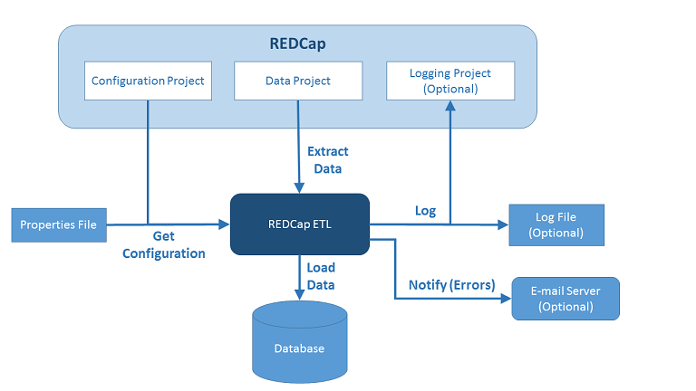

REDCap-ETL Installation Guide
==================================

REDCap-ETL System Components
-------------------------------------------------------
The main components of an installed REDCap-ETL system
are shown in the diagram below, and described in the text below.

* **Configuration File.** This file contains the configuration information for a REDCap-ETL
process. A single REDCap-ETL instance can have multiple configuration files that describe
different ETL processes.
* **REDCap Project.** The REDCap project that contains the data to be extracted.
* **REDCap-ETL.** The software that actually does the Extract, Transform and Load.
* **Database.** REDCap-ETL needs a place where the extracted and transformed data
can be loaded. You can specify a database or, for CSV file output, a directory where the
CSV files are to be stored.
REDCap-ETL can also log information about its processes to a database.
* **E-mail Server.** This is optional, and if set up, is used for e-mailing error
notifications and logging summaries to designated users.
* **Log File.** An optional log file can be set up where REDCap-ETL will log the results of its ETL processes.

Installation Steps
-------------------------------------

### Step 1 - Set up the Server

**Install the System Requirements:**

* PHP 5.6+ or 7+, with:
    * curl extension
    * openssl extension
* Subversion or Git, for retrieving the REDCap-ETL code
* In addition, you need to be using REDCap version 7+

Example commands for setting up an Ubuntu 16 system:

    sudo apt install php php-curl
    sudo apt install git

### Step 2 (Optional) - Set up a Database

If you want to store the extracted and transformed data in a database, instead of CSV files,
you will need to have a database set up that can be accessed by REDCap-ETL.
And, you need to have a user account for the database
that supports at least the following permissions:

* ALTER
* CREATE
* CREATE VIEW
* DROP
* INSERT
* SELECT

The following database systems are currently supported:

* MySQL
* PostgreSQL
* SQL Server
* SQLite

**Note:** By default, REDCap-ETL requires databases to support SSL (secure) communication. This is set
by the db_ssl configuration property, which defaults to true.  If your database does not support
SSL communication, you will get a database error when you run REDCap-ETL.
You can set the db_ssl property to 0 to turn off the database SSL requirement, but this is not
generally recommended for security reasons.

#### MySQL Database Setup Example

Example commands for setting up MySQL on Ubuntu 16:

    sudo apt install php-mysql
    sudo phpenmod mysqli    # enable mysqli extension
    sudo phpenmod pdo_mysql # enable PDO extension for PHP 

    sudo apt install mysql-server
    sudo mysql_secure_installation

    systemctl status mysql.service   # check status

Create a database and database user that will be used as the place to store the REDCap data, for example, in MySQL use:

    CREATE DATABASE `etl`;
    CREATE USER 'etl_user'@'localhost' IDENTIFIED BY 'etlPassword';
    GRANT ALL ON `etl`.* TO 'etl_user'@'localhost';

#### SQLite Setup Example

Example commands for setting up SQLite on Ubuntu 16:

    sudo apt install php-sqlite3  # add PHP support for SQLite
    sudo apt install sqlite3
    sudo apt install sqlitebrowser   # optional

To create a database, in the directory where you want the database, execute, for example:

    sqlite3 etl-data.db
    # then enter ".q" to exit SQLite

### Step 3 - Get the REDCap-ETL Software

The basic Git command to get the code is:

    git clone https://github.com/IUREDCap/redcap-etl

To install the code to the **/opt/redcap-etl** directory, the following command could be used:

    sudo git clone https://github.com/IUREDCap/redcap-etl /opt/redcap-etl

Set the permissions for the new directory as desired. For example, if the process
was being run as user etl in group etl, the following command might be used on a Linux
system:

    sudo chown -R etl:etl /opt/redcap-etl

### Step 4 - Create a Configuration File

The configuration file can be used to specify your entire configuration, or it can
be used in conjunction with a configuration project.

The standard place to store configuration files is in the **config/**
directory of the REDCap-ETL installation. However, they could be stored
in any directory where REDCap-ETL
has read access.

To create a new configuration file, the file **config/config-example.ini**
can be copied and then modified.
See this file, and the [Configuration Guide](ConfigurationGuide.md)
for more information about the configuration properties.

### Step 5 (Optional) - Set up an E-mail Server

You can optionally set up an e-mail server that will be used for logging
errors using e-mail to a specified list of users.

On Ubuntu 16, for example, you can set up an e-mail server using the following command:

        sudo apt install sendmail

The script **bin/email_test.php** can be used to test if e-mail logging
works.

Running the ETL Process
-------------------------------------

There are 2 ways to run REDCap-ETL:

1. __Manual.__ Execute the **bin/redcap_etl.php** command manually on the server
2. __Scheduled.__ Set up a cron job to run the ETL process at specific recurring times

### Running ETL Manually

To run the ETL process manually, you need to run the redcap_etl.php script
and specify the configuration file to use, for example:

        /opt/redcap-etl/bin/redcap_etl.php -c /opt/redcap-etl/config/visits.ini
In the example above:

* `/opt/redcap-etl` is the directory where REDCap-ETL was installed on
  the server
* `/opt/redcap-etl/config/visits.ini` is a configuration file set up
  by a user that specifies an ETL process
  
Depending on how your server is set up, you may need to use
`php /opt/redcap-etl/bin/redcap_etl.php ...` to run
the command.

### Running ETL at Regularly Scheduled Times

On Linux systems, you should be able to set up a cron job to run
ETL processes on a regularly scheduled basis. 

Here is an example crontab entry for a cron job to run the ETL process:

    0 2 * * * cd /opt/redcap-etl/bin; php ./redcap_etl.php \
        -c /opt/redcap-etl/config/visits.ini

For this example:

* `0 2 * * *` indicates that the ETL process will be run at 2:00am
  every day. See cron documentation for more details.
* `/opt/redcap-etl` is the directory where REDCap-ETL has been installed
  in this case
* `redcap_etl.php` is the standard REDCap-ETL script for running the
  ETL process
* `/opt/redcap-etl/config/visits.ini` is the configuration file
  for the ETL process that has been set up by the user

