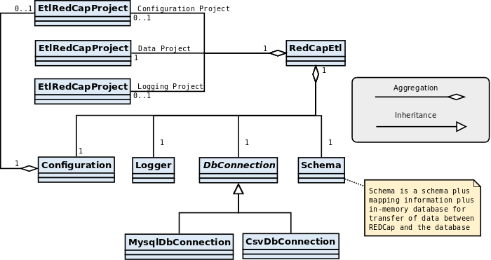
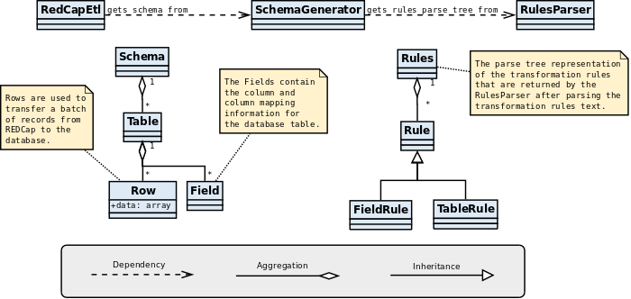

REDCap ETL Software Architecture
=========================================

REDCap ETL Main Classes
------------------------------

**RedCapEtl** is the main class and starting point for the ETL (Extract Transform Load) process. An instance of it is created by the redcap_etl.php script that is used to run the ETL process manually or from a cron job, and by web scripts that are generated to handle REDCap DETs (Data Entry Triggers). 

 

 

Transformation Rules Processing Classes
------------------------------------------

One of the more complicated parts of the ETL process is the translation of the
transformation rules into a target database schema with mapping information.
The transformation rules text is retrieved from either:

* a file on the REDCap ETL server
* the REDCap configuration project
* the **RulesGenerator** class (for automatically generated rules)

The **SchemaGenerator** class uses the **RulesParser** class to translate the transformation rules text into a parse tree representation. The **SchemaGenerator** class then uses the parse tree representation to generate a **Schema** object that contains the target database schema with mapping information. The **Schema** object also contains table rows that are used to store the transformed data from REDCap before it is loaded into the target database.

 

 