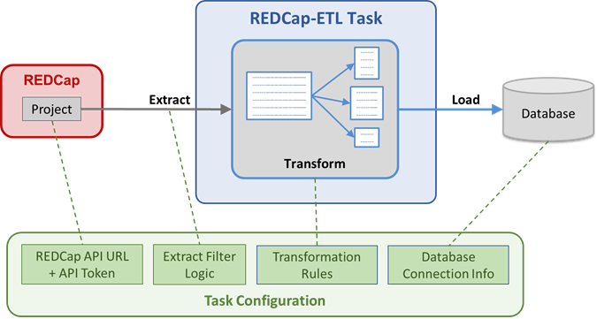

<!-- =================================================
Copyright (C) 2019 The Trustees of Indiana University
SPDX-License-Identifier: BSD-3-Clause
================================================== -->
$
REDCap-ETL User Guide
===================================

Once REDCap-ETL has been successfully installed, you need to create a REDCap-ETL configuration file
for each different ETL process that you want to run, and then specify when the ETL process should run.


Configuration Files
----------------------------

Configuration files specify an ETL process, and include the following information for each phase:

* **Extract.** REDCap projects from where data will be extracted
* **Transform.** Transformation rules that specify how the extracted data should be transformed
* **Load.** Database connection information for the databases where the extracted and transformed data are to be loaded

Starting with version 2.0 of REDCap-ETL, 2 types of configuration files are supported:

1. __Task__ - this is the original configuration format, and it supports the specification of a
    single ETL task that extracts data from a single REDCap project, transforms the extracted
    data, and loads the transformed data into a single database.
2. __Workflow__ - this is the new configuration format and it supports the specification of
    multiple ETL tasks, so a given workflow may in effect read from multiple REDCap projects and
    load data into multiple databases.


### Task Configurations

There are many optional properties that can be specified in a task configuration file,
but the 3 things that need to be specified are:

1. The data source - the REDCap project from which the data are extracted
2. The transformation rules - rules that specify how the extracted data are transformed
3. The database - information specifying where the extracted and transformed data are loaded

REDCap-ETL uses REDCap's API (Application Programming Interface) to extract data from REDCap,
so the API's URL and an API token, which indicates which REDCap project to access,
need to be specified.



REDCap-ETL uses the PHP .ini file format for configurations.
An example of a simple task configuration .ini file is as follows:

```ini
; Extract information - REDCap project
redcap_api_url = https://someplace.edu/redcap/api/
data_source_api_token =  1234567890ABCDEF1234567890ABCDEF

; Transform information - transformation rules
transform_rules_source = 3    ; auto-generate

; Load information - database connection information for where the
; extracted and transformed data should be loaded
db_connection = MySQL:127.0.0.1:etl_user:etl_password:etl_db
```

The .ini files follow the general format of:

```ini
property_name = property_value
```

Semi-colons are used to indicate comments.


You can use the following example file as a starting point for creating an ETL task configuration:

    config/config-example.ini


### Workflow Configurations

Workflows allow you to combine multiple tasks into a unified process.


Workflows use the sections feature of .ini files to indicate different tasks.
Sections are indicated by text within square brackets, and
all properties defined after a section (and before the start of another) belong to that section.

A simple workflow .ini file example that defines 2 tasks ("task1" and "task2") is shown below:

```ini
; Global properties
redcap_api_url = https://someplace.edu/redcap/api/
transform_rules_source = 3    ; auto-generate
db_connection = MySQL:127.0.0.1:etl_user:etl_password:etl_db

[task1]
data_source_api_token =  1234567890ABCDEF1234567890ABCDEF

[task2]
data_source_api_token =  0987654321FEDCBA0987654321FEDCBA
```

Properties defined at the beginning of the file that are outside of a section are
considered to be global properties that apply to all tasks, except where they are
overridden by being redefined within a task.


Configuration files can be stored anywhere that REDCap-ETL can access, but if you want to keep 
these files under the REDCap-ETL software directory, the standard place to store them there
is in the the top-level config directory. The .gitignore file has been set to ignore non-example
configuration files that are placed there.

In workflow configurations, you can also include existing task configuration files
using the **task_config_file** property. For example:


```ini
; Global properties
redcap_api_url = https://someplace.edu/redcap/api/
transform_rules_source = 3    ; auto-generate
db_connection = MySQL:127.0.0.1:etl_user:etl_password:etl_db

[task1]
task_config_file = task1.ini

[task2]
task_config_file = task2.ini
```

You can use the same task configuration file in multiple workflows.

The precedence for configuration properties in a workflow are as follows, from lowest to highest:

1. task configuration file properties
2. global properties
3. task properties

So, task configuration file properties will be overridden by global properties, which will be overridden
by properties defined directly under a task section. In the example above, the redcap_api_url,
transform_rules_source and db_connection properties defined globally will override any 
corresponding properties defined in the task configuration files.

REDCap-ETL configuration files can be formatted as ini files or a JSON (.json) files, but it
is expected that users will use the .ini format, and the JSON format is not covered
in this document. Support for the JSON format was added for internal use by the
REDCap-ETL external module.

For details on configuration, see the [Configuration Guide](ConfigurationGuide.md)


Running an ETL Process
-------------------------------------

Once you have created an ETL configuration file, there are 2 ways you can use it
to run an ETL process:

1. __Manual.__ Execute the **bin/redcap_etl.php** command manually on the server
2. __Scheduled.__ Set up a cron job to run the ETL process at specific recurring times


### Running ETL Manually

To run the ETL process manually, you need to run the redcap_etl.php script
and specify the configuration file to use, for example:

        /opt/redcap-etl/bin/redcap_etl.php -c /opt/redcap-etl/config/visits.ini
In the example above:

* `/opt/redcap-etl` is the directory where REDCap-ETL was installed on
  the server
* `/opt/redcap-etl/config/visits.ini` is a configuration file set up
  by a user that specifies an ETL process

Depending on how your server is set up, you may need to use
`php /opt/redcap-etl/bin/redcap_etl.php ...` to run
the command.

### Running ETL at Regularly Scheduled Times

On Linux systems, you should be able to set up a cron job to run
ETL processes on a regularly scheduled basis. 

Here is an example crontab entry for a cron job to run the ETL process:

    0 2 * * * cd /opt/redcap-etl/bin; php ./redcap_etl.php \
        -c /opt/redcap-etl/config/visits.ini

For this example:

* `0 2 * * *` indicates that the ETL process will be run at 2:00am
  every day. See cron documentation for more details.
* `/opt/redcap-etl` is the directory where REDCap-ETL has been installed
  in this case
* `redcap_etl.php` is the standard REDCap-ETL script for running the
  ETL process
* `/opt/redcap-etl/config/visits.ini` is the configuration file
  for the ETL process that has been set up by the user


### What Happens when REDCap-ETL Runs

#### Task Configuration
When a task configuration is run, REDCap-ETL does the following steps:

1. Run pre-processing SQL on the database (if specified)
2. If any of the database table specified in the transformation rules exist, drop them
3. Create empty table in the database tables for the database table
    specified in the transformation rules
4. In batches specified by the batch_size configuration property:
    1. Extract records for batch_size record IDs from REDCap
    2. Transform the records based on the transformation rules
    3. Load the records into the specified database
5. Run post-processing SQL on the database (if specified)

---
**Note:** each time REDCap-ETL runs, it drops and re-created its database tables,
so any data that was manually entered into its tables will be deleted.
---

#### Workflow Configuration

The processing steps for a workflow are similar to the steps for a task, but there are some differences.
Each task creates a set of tables in a database, and the structure of these tables
(the names of the tables, and column names and types of each table) forms a database schema.
Workflows used a merged database schema for their tasks that load data to the same database.

1. For each load database (workflows can specify more than 1),
    create a merged database schema that consists of all the
    tables created by each tasks that use the database
2. For each task, in order that the tasks are defined:
    1. Run pre-processing SQL (if any)
3. For each database:
    1. Drop all the tables, if they exist, for the merged database schema create above
    2. Create empty tables for the merged database schema
4. For each task, in order of that the tasks are defined, process the REDCap records in
    batches specified by the batch_size configuration property:
    1. Extract records from REDCap
    2. Transform the records based on the transformation rules
    3. Load the records into the database specified for the task
5. For each load database, create primary and foreign keys, if configured
6. For each task, in order that the tasks are defined:
    1. Run post-processing SQL (if any)


#### System-Generated Database Tables

In addition to the tables specified in the transformation rules, REDCap-ETL may (depending on configuration)
generate several system-generated tables:


| table name          | description                                                                        |
| ------------------- | ---------------------------------------------------------------------------------- |
| etl_log             | Main logging table, with one row per task run                                      |
| etl_event_log       | Child logging table, with multiple events per task run                             |
| etl_lookup          | Map from (table name, field name, multiple choice value) to multiple choice label  |
| redcap_project_info | REDCap project information for each task                                           |
| redcap_metadata     | REDCap metadata for the fields for the REDCap projects for which data is extracted |


**Logging Tables**.
The logging tables "etl_log" and "etl_event_log" are intended for 
logging a history of all ETL activity in a database,
so unlike all other tables, the logging tables are not dropped and re-created after each run.
They also will not use the table prefix (if any).

**Lookup Table**.
The lookup table provides a map for multiple choice fields in the database from the value for the choice
to the label for the choice. This table is recreated each time REDCap-ETL is run. 
Tasks belonging to the same workflow
that load data to the same database that have different lookup table
names will cause an error to be generated.
if lookup table generation is specified, one lookup table will be generated for a workflow.

**REDCap Tables**.
The REDCap project info table provides information about the different REDCap projects used in an
ETL process. This table can be used to identify the REDCap project source for each row
int the data tables generated by a workflow.
The REDCap metadata table provides information on the fields in each REDCap project
in an ETL process. Since the intention is that there is only one of each REDCap table per
ETL process (workflow or standalone task), the table prefix (if specified) is not used for these
tables, and an error will result if different tasks of the same workflow specify a different name
for this table.

| table name          | Uses table prefix | Recreated before each ETL run | Number                                      |
| ------------------- |:-----------------:|:-----------------------------:| ------------------------------------------- |
| etl_log             | No                | No                            | 1 per database (unless multiple names used) |
| etl_event_log       | No                | No                            | 1 per database (unless multiple names used) |
| etl_lookup          | No                | Yes                           | 1 for each database in a workflow           |
| redcap_project_info | No                | Yes                           | 1 for each database in a workflow           |
| redcap_metadata     | No                | Yes                           | 1 for each database in a workflow           |


#### Merged Database Schemas

As indicated above, REDCap-ETL creates a merged database schemas for all tasks in a workflow
that load data to the same database.
If the tasks that load data to the same database generate tables that have the same structure (table
names, and column names and types),
then the merged database schemas will be the same as each of the task's database schema. 
However, if the generated database schemas do not match, errors may result from incompatibilities.

Below is a list of possible database schema differences with a description of how the differences are handled. Some
differences are resolved automatically, and some result in an error being generated that needs to be
resolved manually.

* **Column type differences** - tasks with tables with same name that have a column with the same name but different types:
    * char and varchar - the merged schema will use type varchar for the column
    * char and string - the merged schema will use type string
    * varchar and string - the merged schema will use type string
    * char/varchar with different sizes - the larger of the 2 sizes will be used
    * all other type differences - an error will be generated, which needs to be resolved by changing the transformation rules
* **Missing column** - a column name exists in one table, but not in another
    * the column name will be added to the merged database schema, and the task without it
      will generate no data for that column
* **Lookup table name difference** - The lookup table is a system generated table that can be renamed in ETL configurations.
    Schemas support only one lookup table, so having different names will result in an error. This
    error is resolved by changing the workflow configuration to eliminate the different names.


